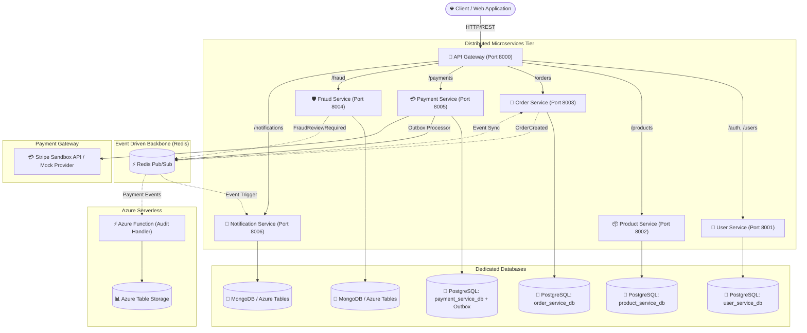

# Intelligent Payment & Order Platform

[](https://github.com/jamoloto-dev/intelligent-payment/actions/workflows/ci.yml)
[](https://www.python.org/downloads/)
[](https://fastapi.tiangolo.com/)
[](https://www.postgresql.org/)
[](https://redis.io/)
[](https://www.docker.com/)
[](https://kubernetes.io/)
[](https://azure.microsoft.com/)

A production-grade, event-driven backend platform designed with **Clean Architecture**, **Microservices**, and **Cloud-Native Principles**. It delivers resilient user authentication, atomic inventory locking, order orchestration, third-party payment processing (Stripe & Mock Provider), transactional outbox reliability, deterministic fraud risk scoring, asynchronous event notifications, and serverless audit trails.

---

## 1. Project Overview

The **Intelligent Payment & Order Platform** solves the challenges of modern e-commerce and fintech transaction pipelines:
- **Zero Race-Condition Inventory**: Atomic row-level locking during checkout prevents overselling.
- **Idempotent Payment Processing**: Client-provided idempotency keys combined with database unique constraints prevent duplicate charges.
- **Transactional Outbox Event Publishing**: Outbox table guarantees atomic persistence and zero lost events upon successful payment transactions.
- **Fail-Safe Fraud Prevention**: Real-time heuristic scoring with safe `REVIEW` fallbacks during network degradation or provider failures.
- **Decoupled Asynchronous Events**: High-speed Redis Pub/Sub drives asynchronous notifications and order state transitions.
- **Compliance & Auditability**: Serverless audit logging records immutable transaction history in Azure Table Storage / NoSQL.

---

## 2. Architecture & Service Topology



---

## 3. Technology Stack

- **Backend Language**: Python 3.12+
- **API Framework**: FastAPI, Pydantic v2, Uvicorn, Starlette
- **ORM & Migrations**: SQLAlchemy 2.0 (Asyncio), Alembic
- **Relational Databases**: PostgreSQL 16
- **NoSQL & Event Store**: MongoDB 7.0, Azure Table Storage (`azure-data-tables`)
- **Event Bus & Distributed Rate Limiter**: Redis 7
- **Cloud Infrastructure**: Azure Container Apps, Azure Key Vault (`azure-keyvault-secrets`, `azure-identity`), Azure Functions (`azure-functions`), Bicep IaC
- **Containerization & Orchestration**: Docker (Multi-stage, Non-root), Docker Compose, Kubernetes (NetworkPolicies, HPA, Probes)
- **Testing & Quality**: Pytest, Pytest-Asyncio, HTTPX, Coverage.py, Ruff, Black, Bandit, Kubeconform

---

## 4. Key Features

1. **Authentication & RBAC**: Secure JWT access tokens with bcrypt password hashing and granular role enforcement (`USER`, `ADMIN`).
2. **Atomic Inventory Reservation**: Concurrency-safe stock reservation using pessimistic DB row locking (`with_for_update()`).
3. **Multi-Provider Payment Architecture**: Pluggable provider design featuring real Stripe API and offline deterministic mock sandbox.
4. **Idempotency Safeguards**: Composite `(user_id, idempotency_key)` unique constraint ensuring concurrency-safe deduplication.
5. **Transactional Outbox Worker**: Payment domain events persisted atomically in the database outbox table before asynchronous Redis dispatch.
6. **Fail-Safe Fraud Engine**: Heuristic risk scoring defaulting safely to `REVIEW` status when fraud verification is unavailable.
7. **Distributed Rate Limiting**: Redis-backed sliding window rate limiter protecting endpoints (120 req/min per IP) with in-memory fallback.
8. **Dependency-Aware Readiness Probes**: Gateway and services return `HTTP 503` when critical dependencies are degraded.
9. **Automated CI/CD**: GitHub Actions pipeline automating linting, code formatting, unit tests, coverage reports, security scanning, Bicep validation, and container builds.

---

## 5. Local Setup & Testing

### 1. Virtual Environment & Dependencies
```bash
python3 -m venv .venv
source .venv/bin/activate
pip install -e ".[dev]"
```

### 2. Run Automated Test Suite
```bash
# Run all tests with coverage
pytest --cov=shared --cov=services --cov=functions

# Run formatting check
black --check .

# Run linter
ruff check .
```

### 3. Start Local System with Docker Compose
```bash
docker compose up --build -d
```

Verify gateway readiness:
```bash
curl http://localhost:8000/health
curl http://localhost:8000/ready
```

---

## 6. Kubernetes Deployment

Production-ready, non-root manifests are located in `infrastructure/kubernetes/`:

```bash
# 1. Apply Namespace, ConfigMaps, and Secrets
kubectl apply -f infrastructure/kubernetes/namespace.yaml
kubectl apply -f infrastructure/kubernetes/configmap.yaml
kubectl apply -f infrastructure/kubernetes/secret.yaml

# 2. Apply Network Policies and Autoscaling rules
kubectl apply -f infrastructure/kubernetes/network-policy.yaml
kubectl apply -f infrastructure/kubernetes/hpa.yaml

# 3. Deploy Databases & Message Broker
kubectl apply -f infrastructure/kubernetes/postgres.yaml
kubectl apply -f infrastructure/kubernetes/redis.yaml
kubectl apply -f infrastructure/kubernetes/mongodb.yaml

# 4. Deploy All Microservices & Ingress
kubectl apply -f infrastructure/kubernetes/user-service.yaml
kubectl apply -f infrastructure/kubernetes/product-service.yaml
kubectl apply -f infrastructure/kubernetes/order-service.yaml
kubectl apply -f infrastructure/kubernetes/fraud-service.yaml
kubectl apply -f infrastructure/kubernetes/payment-service.yaml
kubectl apply -f infrastructure/kubernetes/notification-service.yaml
kubectl apply -f infrastructure/kubernetes/gateway.yaml
kubectl apply -f infrastructure/kubernetes/ingress.yaml
```

---

## 7. Microsoft Azure Cloud Deployment

Deploy the entire platform on Azure using the provided Bicep template:

```bash
export AZURE_RESOURCE_GROUP="rg-intelligent-payment-prod"
export AZURE_LOCATION="eastus"
export AZURE_ENVIRONMENT="prod"
./infrastructure/azure/deploy.sh
```

---

## 8. Security & Compliance

- **Password Hashing**: Bcrypt with unique cryptographic salt per user.
- **Zero Raw Secrets in Git**: Azure Key Vault secret references with User-Assigned Managed Identity RBAC.
- **PCI-DSS Compliant Posture**: Zero raw credit card storage; tokenized payment intents only.
- **Non-Root Containers**: Containers run under dedicated non-root user `appuser` (UID 10001).
- **Network Isolation**: Kubernetes NetworkPolicies isolating internal pod communications.
- **Log Sanitization**: Automated redaction of passwords, tokens, API keys, and sensitive payload attributes.
