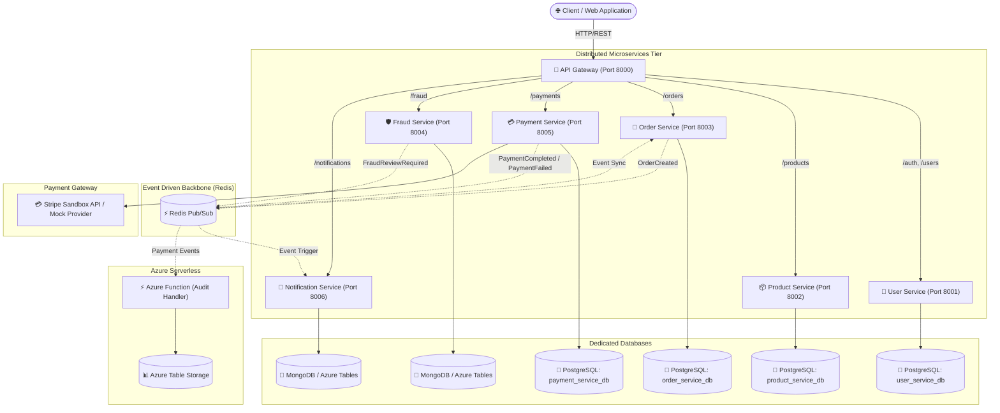

# Intelligent Payment & Order Platform

[](https://github.com/jamoloto-dev/intelligent-payment/actions/workflows/ci.yml)
[](https://www.python.org/downloads/)
[](https://fastapi.tiangolo.com/)
[](https://www.postgresql.org/)
[](https://redis.io/)
[](https://www.docker.com/)
[](https://kubernetes.io/)
[](https://azure.microsoft.com/)

A production-grade, event-driven backend platform designed with **Clean Architecture**, **Microservices**, and **Cloud-Native Principles**. It delivers resilient user authentication, atomic inventory locking, order orchestration, third-party payment processing (Stripe & Mock Provider), deterministic fraud risk scoring, asynchronous event notifications, and serverless audit trails.

---

## 1. Project Overview

The **Intelligent Payment & Order Platform** solves the challenges of modern e-commerce and fintech transaction pipelines:
- **Zero Race-Condition Inventory**: Atomic row-level locking during checkout prevents overselling.
- **Idempotent Payment Processing**: Client-provided idempotency keys prevent duplicate credit card charges.
- **Real-Time Fraud Prevention**: Rule-based heuristic scoring engine checks transaction velocity, geographic consistency, account age, and unusual transaction amounts.
- **Decoupled Asynchronous Events**: High-speed Redis Pub/Sub drives asynchronous notifications and order state transitions without blocking checkout latency.
- **Compliance & Auditability**: Serverless audit logging records immutable transaction history in Azure Table Storage / NoSQL.

---

## 2. Architecture & Service Topology



---

## 3. Technology Stack

- **Backend Language**: Python 3.12+
- **API Framework**: FastAPI, Pydantic v2, Uvicorn, Starlette
- **ORM & Migrations**: SQLAlchemy 2.0 (Asyncio), Alembic
- **Relational Databases**: PostgreSQL 16
- **NoSQL & Event Store**: MongoDB 7.0, Azure Table Storage (`azure-data-tables`)
- **Event Bus & Cache**: Redis 7
- **Cloud Infrastructure**: Azure Container Apps, Azure Key Vault (`azure-keyvault-secrets`, `azure-identity`), Azure Functions (`azure-functions`)
- **Containerization & Orchestration**: Docker, Docker Compose, Kubernetes (K8s)
- **Testing & Quality**: Pytest, Pytest-Asyncio, HTTPX, Coverage.py, Ruff, Black

---

## 4. Key Features

1. **Authentication & RBAC**: Secure JWT access tokens with bcrypt password hashing and granular role enforcement (`USER`, `ADMIN`).
2. **Atomic Inventory Reservation**: Concurrency-safe stock reservation using pessimistic DB row locking (`with_for_update()`).
3. **Multi-Provider Payment Architecture**: Pluggable provider design featuring real Stripe API and offline deterministic mock sandbox.
4. **Idempotency Safeguards**: Header-driven idempotency checks caching and returning existing payment charges without duplicate card debits.
5. **Deterministic Fraud Scoring**: Evaluates 5 risk factors (transaction velocity, order amounts, account age, failed attempts, country mismatch) outputting risk scores (0-100), risk levels, and automated decisions (`APPROVE`, `REVIEW`, `REJECT`).
6. **Multi-Channel Notification Dispatcher**: Asynchronous event listener sending notifications via structured logs and SMTP email channels.
7. **Comprehensive Observability**: Structured JSON logging with automatic redaction of sensitive credentials and correlation tracing via `X-Request-ID`.
8. **Automated CI/CD**: GitHub Actions pipeline automating linting, code formatting, unit tests, coverage reports, and Docker image builds.

---

## 5. Prerequisites

- **Python 3.12+**
- **Docker 24.0+** & **Docker Compose v2.20+**
- **Git**
- **Kubectl** (optional, for Kubernetes deployments)
- **Azure CLI** (optional, for Azure deployments)

---

## 6. Local Setup (Without Docker)

1. **Clone the repository and create a virtual environment**:
   ```bash
   git clone https://github.com/jamoloto-dev/intelligent-payment.git
   cd intelligent-payment
   python3 -m venv .venv
   source .venv/bin/activate
   ```

2. **Install dependencies**:
   ```bash
   pip install -e ".[dev]"
   ```

3. **Configure Environment Variables**:
   ```bash
   cp .env.example .env
   ```

4. **Run Unit and Integration Tests**:
   ```bash
   pytest --cov=shared --cov=services --cov=functions
   ```

---

## 7. Docker Setup (Complete Local System)

Start the entire microservices mesh, databases, and message brokers with one command:

```bash
docker compose up --build -d
```

### Checking Container Health Status
```bash
docker compose ps
```

### Accessing Services & User Interfaces
- **Customer & Admin Web Application**: `http://localhost:3000`
- **API Gateway**: `http://localhost:8000`
- **Interactive Swagger Docs**: `http://localhost:8000/docs`
- **ReDoc API Reference**: `http://localhost:8000/redoc`

### Running the Next.js Frontend Locally
```bash
cd frontend
npm install
npm run dev
```
Open [http://localhost:3000](http://localhost:3000) in your browser.

### Stopping the System
```bash
docker compose down -v
```

---

## 8. Running Automated Tests

The platform includes unit tests, integration tests, security failure mode tests, and end-to-end user journey tests:

```bash
# Run all tests
pytest

# Run tests with coverage breakdown
pytest --cov=shared --cov=services --cov=functions --cov-report=term-missing

# Run code formatting check
black --check .

# Run linter
ruff check .
```

---

## 9. End-to-End Walkthrough Example

### 1. Register User
```bash
curl -X POST http://localhost:8000/auth/register \
  -H "Content-Type: application/json" \
  -d '{
    "email": "alice@customer.com",
    "password": "SecurePassword123!",
    "first_name": "Alice",
    "last_name": "Smith"
  }'
```

### 2. Login & Obtain JWT Token
```bash
curl -X POST http://localhost:8000/auth/login \
  -H "Content-Type: application/json" \
  -d '{
    "email": "alice@customer.com",
    "password": "SecurePassword123!"
  }'
```

### 3. Create an Order
```bash
curl -X POST http://localhost:8000/orders \
  -H "Authorization: Bearer <ACCESS_TOKEN>" \
  -H "Content-Type: application/json" \
  -d '{
    "items": [{"product_id": "<PRODUCT_ID>", "quantity": 2}],
    "shipping_address": "123 Market St, San Francisco, CA"
  }'
```

### 4. Process Payment
```bash
curl -X POST http://localhost:8000/payments \
  -H "Authorization: Bearer <ACCESS_TOKEN>" \
  -H "Content-Type: application/json" \
  -d '{
    "order_id": "<ORDER_ID>",
    "amount": 200.00,
    "currency": "USD",
    "payment_method_id": "pm_card_visa",
    "idempotency_key": "idemp_client_tx_001"
  }'
```

---

## 10. Kubernetes Deployment

Full Kubernetes manifests are provided under `k8s/`:

```bash
# 1. Apply Namespace, ConfigMaps, and Secrets
kubectl apply -f k8s/namespace.yaml
kubectl apply -f k8s/configmap.yaml
kubectl apply -f k8s/secret.yaml

# 2. Deploy Databases & Message Broker
kubectl apply -f k8s/postgres.yaml
kubectl apply -f k8s/redis.yaml
kubectl apply -f k8s/mongodb.yaml

# 3. Deploy All Microservices & Ingress
kubectl apply -f k8s/user-service.yaml
kubectl apply -f k8s/product-service.yaml
kubectl apply -f k8s/order-service.yaml
kubectl apply -f k8s/fraud-service.yaml
kubectl apply -f k8s/payment-service.yaml
kubectl apply -f k8s/notification-service.yaml
kubectl apply -f k8s/gateway.yaml
kubectl apply -f k8s/ingress.yaml
```

---

## 11. Microsoft Azure Cloud Deployment

The platform is designed to deploy on Azure with enterprise resilience:

1. **Azure Container Apps (ACA)**: Managed microservices containers with horizontal auto-scaling (KEDA).
2. **Azure Database for PostgreSQL Flexible Server**: Managed PostgreSQL 16 with automated backups.
3. **Azure Key Vault**: Zero-credential secret injection using Azure Managed Identity.
4. **Azure Table Storage**: Immutable, high-throughput storage for transaction compliance logs.
5. **Azure Functions**: Serverless asynchronous audit log ingestion.

Deploy using the provided Bicep automation script:
```bash
export AZURE_RESOURCE_GROUP="rg-intelligent-payment-prod"
export AZURE_LOCATION="eastus"
./infrastructure/azure/deploy.sh
```

---

## 12. Security & Compliance

- **Password Hashing**: Bcrypt with unique cryptographic salt per user.
- **PCI-DSS Compliant Posture**: Zero raw credit card storage; tokenized payment intents only.
- **Log Sanitization**: Automated redaction of passwords, tokens, API keys, and sensitive payload attributes.
- **Rate Limiting**: Sliding window rate limiter protecting endpoints (120 req/min per IP).
- **Security Policy**: See [SECURITY.md](SECURITY.md) for vulnerability disclosure guidelines.

---

## 13. Troubleshooting & FAQ

| Issue | Cause | Solution |
|---|---|---|
| `503 Service Unavailable` on Gateway | Downstream microservice is booting or unhealthy | Check `docker compose ps` or service logs via `docker compose logs <service-name>` |
| `401 Unauthorized` | Missing or expired JWT token | Obtain a fresh token via `POST /auth/login` and pass `Authorization: Bearer <token>` |
| `400 Insufficient Stock` | Product inventory is depleted | Update inventory via `PUT /products/{id}` with an Admin token |
| `400 Payment Fraud Rejected` | Transaction triggered high-risk fraud rules (> 80 risk score) | Verify transaction amount thresholds and simulated parameters |

---

## 14. Future Improvements & Roadmap

- **Machine Learning Fraud Engine**: Integrate an ONNX / XGBoost model replacing or complementing the deterministic rule engine.
- **Distributed Tracing**: Integrate OpenTelemetry (OTel) with Azure Application Insights / Jaeger.
- **Event Sourcing**: Adopt Kafka or Azure Event Hubs for long-term historical event replay.
- **Multi-Region Active-Active Replication**: Deploy across multiple Azure regions with Azure Front Door.
