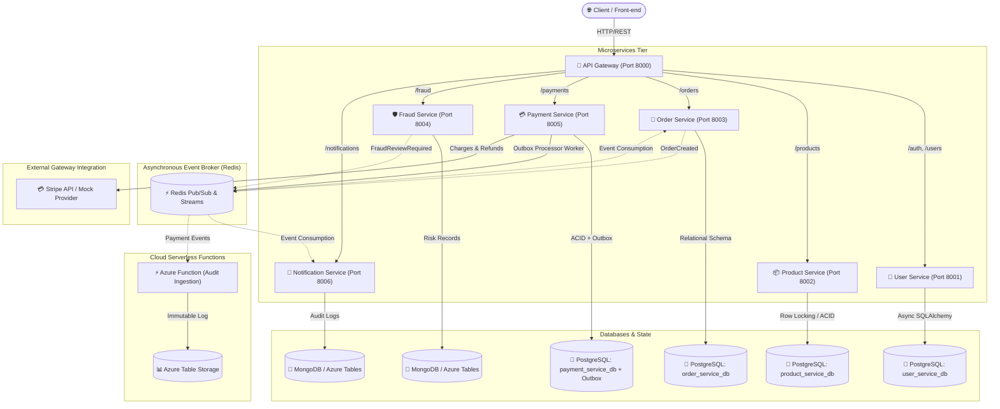

# Platform Architecture Documentation

## 1. System Overview

The **Intelligent Payment & Order Platform** is a distributed, event-driven microservices architecture built with **Python 3.12**, **FastAPI**, **PostgreSQL**, **Redis**, and **MongoDB / Azure Table Storage**.

It provides high-throughput order management, atomic inventory locking, third-party payment processing (Stripe / Mock Provider), real-time fraud risk scoring, transactional outbox event publishing, and asynchronous notifications.

---

## 2. Microservices Architecture Diagram

---

## 3. Microservice Responsibilities

| Service Name | Port | Database | Primary Responsibility |
|---|---|---|---|
| **`api-gateway`** | 8000 | Redis (Distributed Rate Limiting) | Reverse proxy routing, distributed rate limiting (120 req/min), CORS security, request tracing (`X-Request-ID`), dependency health readiness checking (`/ready` returning 503 on dependency loss). |
| **`user-service`** | 8001 | PostgreSQL (`user_service_db`) | User registration, bcrypt password hashing, JWT token issuance & claims, RBAC. |
| **`product-service`** | 8002 | PostgreSQL (`product_service_db`) | Product catalog, pricing, atomic stock reservation & release with `SELECT FOR UPDATE` pessimistic locking. |
| **`order-service`** | 8003 | PostgreSQL (`order_service_db`) | Order lifecycle management, inventory reservation orchestration, event publishing. |
| **`payment-service`** | 8005 | PostgreSQL (`payment_service_db`) | Stripe integration, mock sandbox provider, idempotency keys with compound unique constraint, safe fraud fallback (`REVIEW`), transactional outbox table & worker. |
| **`fraud-service`** | 8004 | MongoDB / Azure Tables | Deterministic rule-based scoring engine (velocity, amounts, age, failure counts) with extensible strategy pattern for ML models. |
| **`notification-service`** | 8006 | MongoDB / Azure Tables | Asynchronous Redis event consumer, multi-channel notification dispatcher (log, email, webhooks). |
| **`audit-function`** | Serverless | Azure Table Storage | Serverless event handler generating tamper-evident compliance audit records. |

---

## 4. Transactional Outbox & Resiliency Patterns

### 1. Transactional Outbox Pattern
When processing payments and refunds, writing the payment state and publishing domain events are atomic:
1. `Payment` record and `OutboxMessage` record are inserted in the **exact same ACID database transaction**.
2. If the database transaction fails, no event is created.
3. Once committed, an immediate asynchronous dispatch is attempted to Redis. If Redis is temporarily unavailable, the `OutboxProcessor` background worker continually polls pending outbox messages and retries delivery with exponential backoff.

### 2. Idempotent Payment Charges
- Database constraint: `UniqueConstraint("user_id", "idempotency_key")`.
- Idempotent deduplication: Pre-check in repository returns existing completed payment; concurrent insert races trigger database uniqueness conflict handled gracefully by catching `IntegrityError` and returning existing payment record without double charging.

### 3. Safe Fraud Fallback
- If the fraud evaluation service is unreachable, times out, or returns a 500 status code, `payment-service` defaults to `decision="REVIEW"`.
- Transactions flagged for review are not charged against payment providers, preventing fraudulent charges during infrastructure degradation.
