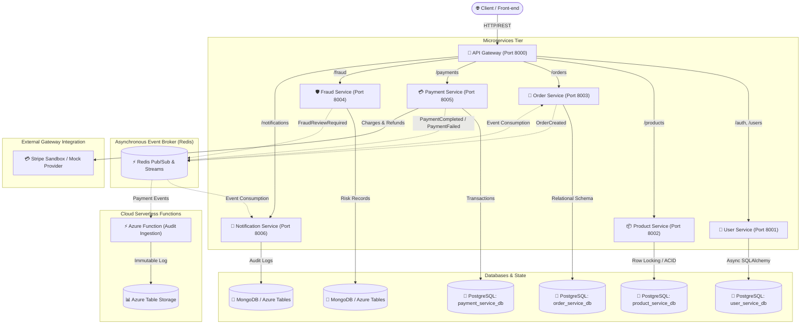
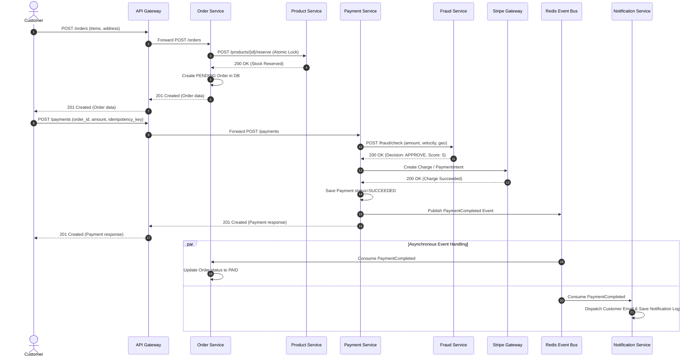

# Platform Architecture Documentation

## 1. System Overview

The **Intelligent Payment & Order Platform** is a distributed, event-driven microservices architecture built with **Python 3.12**, **FastAPI**, **PostgreSQL**, **Redis**, and **MongoDB / Azure Table Storage**.

It provides high-throughput order management, inventory locking, third-party payment processing (Stripe / Mock Provider), fraud risk scoring, and asynchronous event notifications.

---

## 2. Microservices Architecture Diagram

---

## 3. Microservice Responsibilities

| Service Name | Port | Database | Primary Responsibility |
|---|---|---|---|
| **`api-gateway`** | 8000 | In-Memory / Cache | Reverse proxy routing, rate limiting (120 req/min), CORS, request tracing (`X-Request-ID`), aggregated OpenAPI Swagger. |
| **`user-service`** | 8001 | PostgreSQL (`user_service_db`) | User registration, bcrypt password hashing, JWT token issuance & claims, RBAC. |
| **`product-service`** | 8002 | PostgreSQL (`product_service_db`) | Product catalog, pricing, atomic stock reservation & release with `SELECT FOR UPDATE` pessimistic locking. |
| **`order-service`** | 8003 | PostgreSQL (`order_service_db`) | Order lifecycle management, inventory reservation orchestration, event publishing. |
| **`payment-service`** | 8005 | PostgreSQL (`payment_service_db`) | Stripe integration, mock sandbox provider, idempotency keys, refund lifecycle, webhook verification. |
| **`fraud-service`** | 8004 | MongoDB / Azure Tables | Deterministic rule-based scoring engine (velocity, amounts, age, failure counts) with extensible strategy pattern for ML models. |
| **`notification-service`** | 8006 | MongoDB / Azure Tables | Asynchronous Redis event consumer, multi-channel notification dispatcher (log, email, webhooks). |
| **`audit-function`** | Serverless | Azure Table Storage | Serverless event handler generating tamper-evident compliance audit records. |

---

## 4. Synchronous vs Asynchronous Communication

